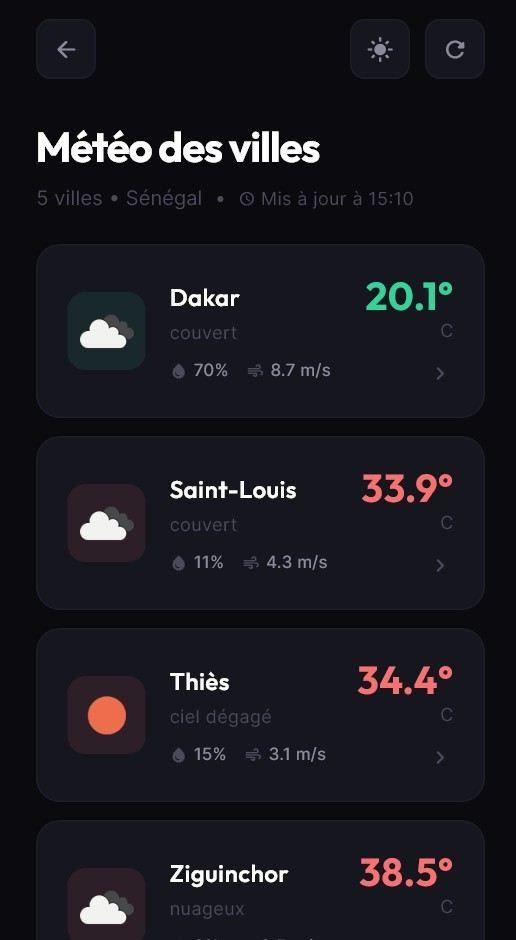
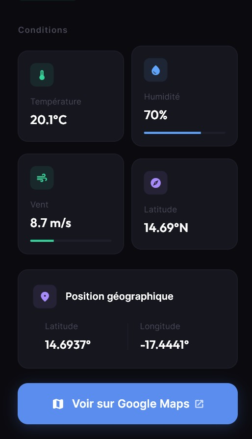

# Examen Développement Mobile - L3GL ISI 2026

Application Flutter de météo en temps réel.

## Membres du groupe

- Membre 1 : Moussa Dione
- Membre 2 : Madieye Anne
- Membre 3 : Abdoulaye B.S.Diop

## Description

Application qui récupère les données météo en temps réel pour 5 villes, affiche une jauge de progression animée et permet de visualiser les résultats sur une carte interactive via Google Maps.

## Fonctionnalités

- Écran d'accueil avec message d'introduction
- Jauge de progression animée avec messages dynamiques
- Appels API météo (OpenWeatherMap) pour 5 villes
- Tableau interactif des données météo
- Page détail par ville avec localisation Google Maps
- Gestion des erreurs avec possibilité de réessayer
- Mode sombre et clair

## Captures d'écran

### Écran d'accueil


### Écran de chargement


### Tableau des résultats météo


### Détail d'une ville


## Arborescence

```
lib/
├── main.dart
├── models/
│   └── weather.dart
├── screens/
│   ├── home_screen.dart
│   ├── loading_screen.dart
│   ├── weather_table_screen.dart
│   └── city_detail_screen.dart
├── services/
│   └── weather_service.dart
└── widgets/
    └── theme_toggle.dart
```
